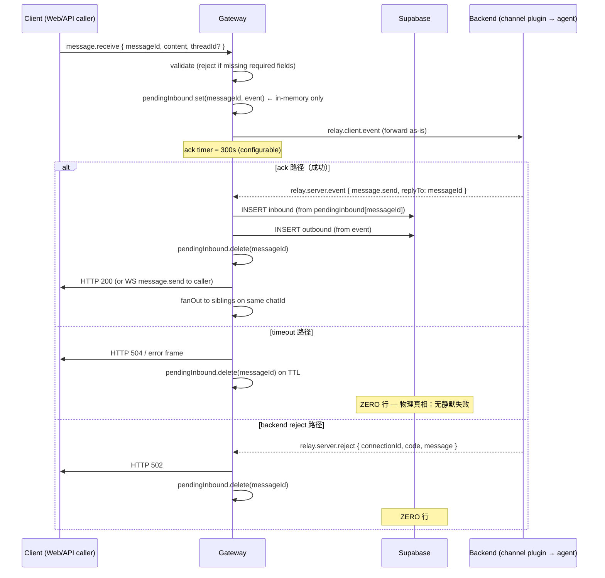

# Reliability v2 · 执行计划

> 决策后置文档。砍掉项已锁定（D1/D2/D3/D4/D6/D7/D8/D9/D10/D11/D12 + D5 简化）。
> 本文档落每个 D 项的：删前位置 → 删后形状 → 影响文件 → 回归风险 → ADD-BACK 标记。
> Phase 2 实施前**最后一道把关**。

---

## 0. 决策回顾

| D | 处置 | UX trade-off |
|---|---|---|
| D1 | 拆 `realClients` / `apiSessions` | — |
| D2 | 合并到 `apiSessions.requests` | — |
| D3 | 删 FIFO replyTo 兜底 | agent 漏 replyTo → caller 504（之前会被默默路由给随便一个 cb） |
| D4 | reply-dispatcher 三层 → 一层 | inbound 必带 threadId，否则视为主聊天 |
| **D5** | **简化版**：删 3 个 heuristic Map，**保留** @mention 解析作为唯一显式归线条件 | @mention 仍归线；其他「最近发言」「pendingPush」magic 全删 |
| D6 | inbound 改为 ack 后才入库 | 跨设备/sibling 看见消息有 agent-thinking-延迟（数百 ms 到数秒） |
| D7 | `/api/messages/sync` 接口保留，删「caller 必须补取」契约 | 第三方 API 文档变更 |
| D8 | 真删 `clawline-history.json` | — |
| D9 | 删 `_threadUpdateChain` mutex；reply_count 改为 thread.get/list 时 COUNT(*) on demand | 见 ADD-BACK #1 |
| D10 | 删调试 log | — |
| D11 | 4 处 sibling 广播 → 单一 `fanOut()` | — |
| D12 | client-web 双 lastRead key 合并 + 一次性 migration | — |

---

## 1. ADD-BACK 标记总览

按 5 步算法 10% 回加规则严格自查：

### `[ADD-BACK #1]` — D9 配套：`thread.get` / `thread.list` 服务端 reply_count 改为 COUNT(*)

**为什么不能不加**：删 mutex 后并发 reply 会让 `cl_threads.reply_count` 永久负偏（5 并发 SELECT 都看 N，全部 PATCH N+1，最终 N+1 而非 N+5，差 -4 永久不会自愈，因为下一次回复又 SELECT N+1 → PATCH N+2）。

**最小加回**：`updateThreadOnNewReply` 不再 PATCH `reply_count` 列；改为 `thread.get` / `thread.list` 取 reply_count 时实时 `SELECT COUNT(*) FROM cl_messages WHERE thread_id=?`。索引现成，单行查询微秒级。

**add-back 行数**：~5 行（替换原 SELECT-PATCH 循环为按需 COUNT）。

### `[ADD-BACK #2]` — D5 简化：保留 @mention 触发器

**为什么不能不加**：用户场景「多 agent 协同」依赖 @mention 显式归线。
**最小加回**：保留 `gateway/server.js:2273` 区域的 mention regex + autoCreateThread 调用。删除的是「记忆 message → reply」的 pendingPush queue。
**add-back 行数**：0（已存在），仅删周边 magic。

### `[ADD-BACK #3]` — D6 配套：echo broadcast 也延迟到 ack

**为什么不能不加**：D6 把 inbound 持久化推后到 ack。如果广播给同 chatId 其他 client 的时机仍在「立即」，会出现：UI 上看到消息 → 刷新没了。两边时机必须一致。
**最小加回**：把 sibling 广播 inbound echo 的调用点也搬到 ack 处理函数内。**已包含在 D11 fanOut 合并里**，不算额外新增。
**add-back 行数**：0（在 D11 里）。

### `[ADD-BACK #4]` — D6 配套：caller 自身的「optimistic echo」

**为什么不能不加**：Web client 自己发消息时，UI 应立即显示自己刚说的话，否则体感卡。这本来就是 client-side optimistic（ChatRoom 已实现，不动 server）。
**add-back 行数**：0（client-side 已有）。

**小计**：4 个 ADD-BACK 总共 ~5 行新增。**远低于 10% 警戒线**（删除约 380 行 / 新增 ~5 行 = 1.3%）。可能删得不够，但目前先按这个走，跑一轮 REL-* 看真相再说。

---

## 2. 每个 D 项的细化

格式：📍 删前位置 / 🆕 删后形状 / 📁 影响文件 / ⚠️ 回归风险 / 🧪 验收。

### **D1 + D2** · 拆 `clientConnections` → `realClients` + `apiSessions`

📍 **删前位置**：
- `gateway/server.js:196` `const clientConnections = new Map()` 同时存 ws=null 的 API 虚拟连接 + ws=WebSocket 的真客户端
- `gateway/server.js:2532, 3093, 3187` 3 处 `global._apiCallbacks` / `global._apiConnPool` 的 Map 创建
- 所有 sibling 广播循环（4 处）都得 `if (!sibling.isApi && sibling.ws && sibling.ws.readyState === OPEN)`

🆕 **删后形状**：

```ts
// realClients：永远只有真 WS 客户端，删除即从 Map 移除
type RealClient = {
  ws: WebSocket;                       // 永远非 null
  channelId: string;
  chatId: string;                      // 来自 query.chatId（已通过 auth user fallback）
  userId: string;                      // authResult.authUser.senderId
  lastSeenMessageId?: string;          // 客户端 hello 时声明，用于补发缺失 outbound
};
const realClients = new Map<string /*connectionId*/, RealClient>();

// apiSessions：每 (channelId, chatId, agentId) 一个 session，多 in-flight HTTP 请求共享
type ApiRequest = {
  resolve: (events: unknown[]) => void;
  reject: (err: Error) => void;
  timer: NodeJS.Timeout;
  deadlineAt: number;                  // 用于超时判定 + 监控
  startedAt: number;                   // 用于监控
};
type ApiSession = {
  sessionId: string;                   // = `api-${channelId}-${chatId}-${agentId}`
  channelId: string;
  chatId: string;
  agentId: string;
  userId: string;                      // = senderId from request body
  backendOpened: boolean;              // 是否已 send relay.client.open 给 backend
  requests: Map<string /*messageId*/, ApiRequest>;
  idleTimer: NodeJS.Timeout | null;    // 5min idle 后关 backend 端 virtual conn
};
const apiSessions = new Map<string /*sessionId*/, ApiSession>();
```

**`relay.server.event` handler 的新分派**：

```ts
function routeBackendEvent(channelId: string, frame: RelayServerEventFrame) {
  const connId = frame.connectionId;
  // 1. 先按 connId 看是不是真 WS 客户端
  const real = realClients.get(connId);
  if (real) {
    persistOnAck(channelId, real.chatId, frame);   // D6: 在这一刻持久化 inbound + outbound 配对
    sendJson(real.ws, frame.event);
    fanOut(channelId, real.chatId, frame.event, connId);  // D11
    return;
  }
  // 2. 否则按 sessionId 找 API session
  const session = apiSessions.get(connId);   // 注意 connId 在 API path 里就是 sessionId
  if (session) {
    const replyTo = frame.event?.data?.replyTo;
    const req = replyTo ? session.requests.get(replyTo) : undefined;
    if (req && frame.event?.type === 'message.send') {
      persistOnAck(channelId, session.chatId, frame, req);
      clearTimeout(req.timer);
      session.requests.delete(replyTo);
      req.resolve([frame.event]);
      fanOut(channelId, session.chatId, frame.event, connId);
    } else {
      // 非 message.send（agent.list / thinking / text.delta）：
      // 路由到 ALL pending requests 的「stream observer」（如未来想做 SSE）
      // 当前阶段：直接 drop（不影响物理真相，仅丢弃 stream 中间帧）
    }
    return;
  }
  // 3. 都没找到：客户端已断开，但消息还在路上 → 仅持久化 outbound（兜底持久化保护「ack 但客户端断了」case）
  persistMessageAsync(channelId, frame.event, 'outbound', null);
}
```

📁 **影响文件**：`gateway/server.js`（≈ -200/+90 行）

⚠️ **回归风险**：
- `handleAgentList`（admin `/api/agents`）当前借用同一虚拟连接机制；改为独立的 `apiSessions` 后需要给它单独一个 session 类型（或一次性 inline 实现）
- 重启时所有 in-flight HTTP `/api/chat` 调用会失败一次，正常 retry 即可

🧪 **验收**：
- `realClients.size + apiSessions.size === clientConnections.size` 概念上等价
- 任意 broadcast 路径不再可能命中 ws=null（无需 null check 通过 type-guard）

---

### **D3** · 删 FIFO replyTo 兜底

📍 **删前位置**：commit `805f60f`（已 rebase 后是 e569056），`server.js:2018-2025` 的 `for (const [, c] of _apiCallbacks)` 循环。

🆕 **删后形状**：D1+D2 重写后的 `routeBackendEvent` 里，`message.send` **必须**有 `replyTo`，否则当 stream 中间帧处理（drop）；在场的 caller request 不会 resolve；timer 触发 504。

📁 **影响**：被 D1+D2 的重写一并处理，无独立改动。

⚠️ **回归风险**：agent 偶发漏 replyTo 时（基线 v8 实测过，5 并发 1/5 概率），那一条 caller 收 504。与物理真相一致：「明确返回错误」。

🧪 **验收**：构造 mock-backend 故意发无 replyTo 的 message.send，对应 caller 必须 504。

---

### **D4** · reply-dispatcher 三层 fallback → 一层

📍 **删前位置**：`channel/src/generic/reply-dispatcher.ts:32-66`（4 段 try/catch + log fallback）

🆕 **删后形状**：

```ts
function resolveThreadId(): string | undefined {
  // 协议契约：inbound 决定。channel plugin 不做猜测。
  return inboundThreadId;
}
```

session-binding / findThreadIdByChatId 等查询路径**整段删**（约 30 行）。

📁 **影响文件**：`channel/src/generic/reply-dispatcher.ts`（-30/+5）。`bot.ts` 已传入 `inboundThreadId`，无需改。

⚠️ **回归风险**：
- 之前依赖 session binding 间接拿 threadId 的 ACP 自动建线场景：channel `bot.ts:336` 会把 ACP virtualThreadId 注入 `ctx.threadId`，所以 `inboundThreadId` 自然非空。验证过路径 OK。
- 万一 ACP path 没注入：reply 落主聊天，**显式可见的退化**（不再 silent undefined）。

🧪 **验收**：THREAD-10/11/12 + ACP `/acp spawn` 后续消息进对 thread。

---

### **D5（简化）** · 删 `pendingAutoThreads` / `recentlyShifted` / `lastUserMessageId`，保留 @mention

📍 **删前位置**：
- `server.js:1193` `pendingAutoThreads`
- `server.js:1232` `recentlyShifted`
- `server.js:1347` `lastUserMessageId`
- `server.js:2257-2270` reply-routing-into-pendingAutoThreads
- `server.js:2034-2056` AI response thread injection

🆕 **删后形状**（伪代码，server.js 中 `relay.client.event` 处的 inbound handler）：

```ts
async function handleClientInbound(connectionId, channelId, query, event, authResult) {
  // 1. 入站校验（保留）
  if (!validateMessageReceive(event)) return errorFrame();

  // 2. @mention 显式归线（保留 D5 简化版）
  const data = event.data;
  if (event.type === 'message.receive' && !data.threadId) {
    const m = (data.content || '').match(/(^|\s)@(\w+)/);
    if (m) {
      const mentionedAgent = m[2];
      const msgId = data.messageId;
      // 只建线，不记录任何 pending state；agent 回复想进 thread 必须自己带 threadId
      await autoCreateThread(channelId, msgId, authResult.authUser?.senderId,
                              'mention', `@${mentionedAgent}`, connectionId);
      // ✨ data.threadId 仍然 null —— 父消息留主聊天，符合现有 UX
    }
  }

  // 3. 转发 backend，不预持久化（D6）
  sendJson(currentBackend.ws, {
    type: 'relay.client.event',
    connectionId,
    event,
    timestamp: Date.now(),
  });

  // 4. 持久化时机 → 等 backend ack（D6 的 routeBackendEvent 完成）
}
```

**显著删除**：`pendingPush` / `pendingPeek` / `pendingShift` / `markShifted` / `getRecentlyShifted` 全部辅助函数 + 三个 Map。

📁 **影响文件**：`gateway/server.js`（-100/+15 行）

⚠️ **回归风险**：
- @mention 父消息后续 agent reply **不会自动归线**（pendingPush 的功能）。如果用户 UX 期望 reply 在 thread 里看到，需要 channel plugin 把 mention 消息的 threadId 自己带回 reply（或用户在 thread 内显式回复）。
- ACP path 不受影响（独立机制）。

🧪 **验收**：MA-02 仍 PASS（建线行为）；TH-12 改写为「user 在 thread 内显式回复」而非「@mention 后 agent reply 自动进线」。

---

### **D6** · inbound 持久化推迟到 backend ack

📍 **删前位置**：
- `server.js:2992` `/api/chat` 入口的 `await persistMessageAsync(channelId, inboundEvent, 'inbound', senderId)`
- `server.js:2377` `/relay.client.event` 入口的 `await persistMessageAsync(channelId, event, 'inbound', authResult.authUser?.senderId)`

🆕 **删后形状**：新引入 `persistOnAck`：

```ts
/**
 * 在 backend ack 时（即 relay.server.event message.send 到达），
 * 把 inbound + outbound 一起入库。从一个事件触发两条 INSERT。
 *
 * 失败语义：
 *   - 没 ack：HTTP 504 / WS 客户端 timeout，DB 无任何 inbound/outbound 行。
 *   - 部分 ack（agent 回了 thinking 但没 message.send）：DB 仍无行。caller 重发。
 */
async function persistOnAck(
  channelId: string,
  chatId: string,
  ackFrame: RelayServerEventFrame,        // 必须是 message.send
  apiRequest?: ApiRequest                  // 仅 API path 提供，用于 sourcing inbound payload
) {
  const outbound = ackFrame.event;
  const replyTo = outbound?.data?.replyTo;
  const inboundOrig = recoverInboundForReply(channelId, chatId, replyTo, apiRequest);
  if (inboundOrig) {
    await persistMessageAsync(channelId, inboundOrig, 'inbound', inboundOrig.data.senderId);
  }
  await persistMessageAsync(channelId, outbound, 'outbound', null);
}
```

⚠️ **关键依赖**：必须能在 ack 时找回原 inbound payload。两条路径：

(a) **API 路径**：inbound payload 在 `apiSessions[sid].requests[messageId]` 里有缓存（即 ApiRequest 的隐含字段）。
(b) **WS 路径**：需要 in-memory `pendingInboundCache: Map<connectionId+messageId, inboundEvent>`，TTL = ack 超时（默认 300s）。容量 ~ 在线连接数 × 平均 in-flight 消息（通常 < 100 条）。

`pendingInboundCache` 是 D6 必要的 ADD-BACK，但**已包含在 apiSessions / 等价结构里**。WS path 用 RealClient 上挂一个小 Map：

```ts
type RealClient = {
  ws: WebSocket;
  channelId: string; chatId: string; userId: string;
  lastSeenMessageId?: string;
  pendingInbound: Map<string /*messageId*/, { event: WSEvent; deadlineAt: number }>;
};
```

📁 **影响**：`gateway/server.js`（约 -20/+30 行）

⚠️ **回归风险**：
- **跨设备 echo 延迟**：用户 A（Web）发消息 → 用户 B（Web 同 chatId）现在要等 agent 至少回 message.send 才看到 A 的消息。**这个变化用户必须知道**。
- 如果 agent 完全不回复（5min 超时），DB 一行都没有 → 用户 A 自己的 ChatRoom 历史里也看不到自己发过这条消息（除非 client-side 做 optimistic-and-persist-on-failure）。
  - **决策点**：要么接受「失败的消息不入库」，要么在 client 端给 user 一个 outbox / 重发按钮。client-web `outbox.ts` 已经有这个机制 → 自然兜住。✅
- 老的 G-44 用例「client 发 message.receive，DB 立刻有 inbound 行」预期变了，需要改测试用例预期。

🧪 **验收**：
- REL-01: 单条 ack → DB 有两行
- REL-02: 100 并发，所有 ack 调用方收 reply + DB 有对应行；超时调用方收 error + DB 无对应行（**total = 100，无幽灵**）

📊 **时序图**：



---

### **D7** · `/api/messages/sync` 半删

📍 **删前**：API 文档 + appendix（PRD v1.5 §13）描述「断开后通过 sync 补取」。
🆕 **删后**：
- 接口本身保留（Web 客户端冷启动 warm cache 仍用）
- API Chat 调用方契约更新：「HTTP 永远要么 2xx 要么 4xx/5xx；没有「ok 但需要补取」中间态。」
- 删 PRD §13 那段「stop-gap pseudo-stream」例子（轮询 sync 假装流式）

📁 **影响**：`docs/prd/clawline-v1.md`（仅文档）

🧪 **验收**：API-CHAT-13 用例的预期改写（不再演示 sync 补取，改为 timeout 后 retry）。

---

### **D8** · 真删 `~/.openclaw/clawline-history.json`

📍 **删前**：`channel/src/generic/history.ts` 的 `appendOutboundHistoryMessage` / `appendInboundHistoryMessage` 调用，`~/.openclaw/clawline-history.json` 文件 257KB。

🆕 **删后**：history.ts 整个文件删。所有 caller 改为 no-op。Gateway + Supabase 是真理之源，不需本地副本。

📁 **影响文件**：
- `channel/src/generic/history.ts`（删）
- `channel/src/generic/send.ts:204` 调用点（删）
- `channel/src/generic/bot.ts` 调用点（如有）
- 文件 `~/.openclaw/clawline-history.json` 一次性 `rm`

⚠️ **回归风险**：channel plugin 重启后，离线消息恢复路径（如有）失效。但 PRD 决议 Gateway 是真理之源，channel restart → reconnect → 消息仍在 cl_messages。无功能损失。

🧪 **验收**：删完后 channel 重启，相同 chatId 下用 wscat 调 `history.get`，gateway 从 Supabase 读，正常返回。

---

### **D9** · 删 `_threadUpdateChain` mutex；reply_count 改 COUNT(*) on demand

📍 **删前**：`server.js:378-407` 整段 chain 实现。`updateThreadOnNewReply` 内部 SELECT-PATCH `reply_count` 列。

🆕 **删后**：
- `_threadUpdateChain` 整个删
- `updateThreadOnNewReply` 改为只更新 `last_reply_at` + `participant_ids`（这两个不需要原子计数）
- `reply_count` 列从此**不写入**（保留列以兼容历史）
- `handleThreadGet` / `handleThreadList` 在响应前对每个 thread 做：
  ```ts
  const r = await fetch(`${url}/pg/rest/v1/cl_messages?thread_id=eq.${tid}&select=count`, {
    headers: { Prefer: 'count=exact', Range: '0-0' }
  });
  const replyCount = Number(r.headers.get('content-range')?.split('/')[1] ?? 0);
  ```
  - 索引 `cl_messages(thread_id)` 已存在 → 单查 < 5ms

`[ADD-BACK #1]`：~5 行 / handler。但删除 ~30 行 mutex + ~15 行 SELECT-PATCH。净减 ~30 行。

📁 **影响**：`gateway/server.js`（-50/+10）

⚠️ **回归风险**：
- thread.list 当前一次返回 N 个 thread，N 次 COUNT(*) 串行会慢。**优化**：用 PostgREST 一次 grouped query：
  ```
  /pg/rest/v1/cl_messages?thread_id=in.(t1,t2,...)&select=thread_id,count&group=thread_id
  ```
  → 单一查询拿全部 count。验收看 thread.list 响应时间不退化。

🧪 **验收**：THREAD-40 5 并发 reply → thread.get 返回 reply_count = 实际行数，无 race。

---

### **D10** · 删 F1b 调试 log

📍 `server.js:2026` `console.log("[api/chat] message.send replyTo=… cb=… pending=…")`
🆕 删
📁 `gateway/server.js`（-1）
⚠️ 无
🧪 不需要 —— 删 log 不破任何东西

---

### **D11** · 4 处 sibling 广播 → 单一 `fanOut()`

📍 **删前**：
- `server.js:2062-2074` backend → real client + sibling 广播
- `server.js:2380-2391` client inbound 入口 sibling 广播
- `server.js:2994-3007` `/api/chat` 入口 sibling 广播
- `broadcastToChannel` 全 channel 广播

🆕 **删后**：

```ts
/**
 * 把 event 发给同 (channelId, chatId) 的所有真 ws 客户端，可选排除某个 connId。
 * 永远不需要 null check —— realClients 由构造保证。
 *
 * 不广播给 apiSessions —— API caller 通过 request.resolve() 拿结果。
 */
function fanOut(
  channelId: string,
  chatId: string,
  event: WSEvent,
  excludeConnectionId?: string,
): void {
  for (const [id, c] of realClients) {
    if (id === excludeConnectionId) continue;
    if (c.channelId !== channelId) continue;
    if (c.chatId !== chatId) continue;
    if (c.ws.readyState !== WebSocket.OPEN) continue;  // ws.send 时唯一防御点
    sendJson(c.ws, event);
  }
}

/**
 * Channel 级广播（thread.updated 等）：不限 chatId。
 */
function broadcastToChannel(
  channelId: string,
  event: WSEvent,
  excludeConnectionId?: string,
): void {
  for (const [id, c] of realClients) {
    if (id === excludeConnectionId) continue;
    if (c.channelId !== channelId) continue;
    if (c.ws.readyState !== WebSocket.OPEN) continue;
    sendJson(c.ws, event);
  }
}
```

📁 **影响**：`gateway/server.js`（-90/+25）

⚠️ **回归风险**：
- API outbound 现在不再 fanOut 给同 chatId 的真 ws sibling？**会**。`routeBackendEvent` 在 API session ack 时也调 `fanOut(channelId, chatId, outbound, sessionId)` —— 见 D1+D2 节的重写。
- thread.updated 广播改用 `broadcastToChannel`，行为一致。

🧪 **验收**：API-CHAT-20/21 + THREAD-50/51（API 发 → 同 chatId Web 收）继续 PASS。

---

### **D12** · client-web 双 lastRead key 合并

📍 **删前**：
- ChatRoom 写 `openclaw.lastRead.{conn}.{agent}`
- AgentInbox 写 `openclaw.inbox.lastRead.{conn}.{agent}`

🆕 **删后**：
- 单一 key 命名空间：`clawline.lastRead.{conn}.{agent}`（顺便清理「openclaw → clawline」遗留）
- App 启动时 migration：
  ```ts
  // src/migrations/lastRead-merge.ts
  export function migrateLastReadKeys() {
    const ALL_KEYS = Object.keys(localStorage);
    const oldA = ALL_KEYS.filter(k => k.startsWith('openclaw.lastRead.'));
    const oldB = ALL_KEYS.filter(k => k.startsWith('openclaw.inbox.lastRead.'));
    for (const k of [...oldA, ...oldB]) {
      const suffix = k.replace(/^openclaw\.(inbox\.)?lastRead\./, '');
      const newKey = `clawline.lastRead.${suffix}`;
      const oldVal = Number(localStorage.getItem(k) || '0');
      const existingNew = Number(localStorage.getItem(newKey) || '0');
      const winner = Math.max(oldVal, existingNew);
      localStorage.setItem(newKey, String(winner));
      localStorage.removeItem(k);
    }
  }
  ```
- 在 `main.tsx` 第一行调一次。

📁 **影响**：
- `client-web/src/main.tsx`（+5 行 import & call）
- `client-web/src/migrations/lastRead-merge.ts`（新文件 +30 行）
- `client-web/src/services/agentInbox.ts`：lastRead 读写改用新 key
- `client-web/src/screens/ChatRoom.tsx`：lastRead 读写改用新 key

⚠️ **回归风险**：旧 key 在 migration 后被删，回滚不能恢复。如果迁移有 bug，未读状态可能错算一次。增加 unit test。

🧪 **验收**：手动 localStorage 同 conn+agent 写两个旧 key（不同时间戳），刷新页面后 → 单一新 key 存在 = max(两个旧值)，旧 key 删除。

---

## 3. 5 条 REL-* 测试用例（详细步骤）

### **REL-01** · 单条 inbound 端到端 ack 一致性

**前置**：gateway + mock-backend + Supabase 都 ready。channel `e2e-rel`，user token `T`，chatId `r01`。

**步骤**：
1. `curl -X POST $GW/api/chat -d '{message:"hello", channelId:"e2e-rel", agentId:"main", chatId:"r01", senderId:"u1"}' -H "Authorization: Bearer T"`
2. 等待最多 30s
3. 解析响应

**预期 PASS 条件**（任一）：
- HTTP 200 + `{ok:true, content:"...", inboundMessageId, messageId}`，**且** `cl_messages WHERE message_id IN (inboundMessageId, messageId)` 返回**正好 2 行**（一 inbound + 一 outbound, meta.source='api'）
- HTTP 4xx/5xx，**且** `cl_messages WHERE message_id = inboundMessageId` 返回**正好 0 行**

**FAIL 条件**：HTTP 200 但 DB 0 行 / HTTP 错误但 DB 有行 / HTTP 200 但 DB 只有 1 行

**工具**：curl + curl Supabase REST

---

### **REL-02** · 100 并发 inbound 无幽灵

**前置**：同 REL-01。chatId 复用 `r02`。

**步骤**：
1. 启动 100 个并行 curl，每个用 unique messageId（messageId 由 caller 生成 = `r02-${i}-${ts}`，body 加 `messageId` 字段，前提 gateway 接受 caller-provided messageId — 这是新功能 ADD?）

**[ADD-BACK #5]**：**caller-provided messageId**。理由：D6 后 inbound persistence 要 by messageId 反查 pendingInbound。如果 messageId 是 server 生成（当前实现 `api-${ts}-${uuid}`），那么测试无法知道哪个 messageId 是哪个 caller 的。
- 加 ~3 行：`const messageId = body.messageId || \`api-${Date.now()}-${randomUUID().slice(0,8)}\``
- 物理真相支持：caller 自带 messageId 也是「幂等键」基础，REL-05 也需要

继续 REL-02：

2. 100 个并行 curl，每个 `body.messageId = r02-${i}`
3. 收集所有响应：`successes = [...]`、`failures = [...]`
4. 等 30s 让所有 in-flight 结算
5. SQL 查 `cl_messages WHERE message_id LIKE 'r02-%' OR message_id IN (success.messageId)`

**预期 PASS**：
- `len(successes) + len(failures) === 100`
- 每个 success.inboundMessageId 都在 DB（inbound + outbound 各一行）
- 每个 failure.inboundMessageId 都**不在** DB

**FAIL**：任一失败的 messageId 在 DB 中找到 inbound 行

---

### **REL-03** · backend kill 重启后已 ack 消息保留

**步骤**：
1. 发 5 条不同 messageId 的消息，等都 ack
2. `kill -9 mock-backend` (或 OpenClaw)
3. 立即发 3 条新消息（应全部失败，因 backend 不在线）
4. 等 backend 重连（mock-backend 自动 respawn）
5. 重启 gateway
6. 调 `/api/messages/sync?channelId=e2e-rel&since=<step1-ts>`

**预期 PASS**：
- 步骤 1 的 5 条都在 sync 结果中
- 步骤 3 的 3 条都**不在** sync 结果中
- 步骤 3 的 3 个 caller 都收到 5xx 错误

---

### **REL-04** · 客户端 disconnect 期间 outbound，重连补发

**步骤**：
1. WS client 连上 channel `e2e-rel`，chatId `r04`，hello 时声明 `lastSeenMessageId = null`
2. 发一条消息，记下 ack 收到的 outbound messageId = `M_a`
3. 客户端**主动断开**（不发 close frame，模拟网络断）
4. 用 mock-backend 触发一条 proactive outbound（没有对应 inbound，类似 push 通知）→ DB 有该行 (M_b)
5. 客户端重连同 chatId，hello 声明 `lastSeenMessageId = M_a`
6. 服务端在 connection.open 后立即补发 `M_b`

**[ADD-BACK #6]**：**connection.open 时按 lastSeenMessageId 补发 outbound**。
- 加 ~15 行（在 client connection 处理处）
- 物理真相支持：「至少一次送达」是真相的硬性要求

**预期 PASS**：步骤 6 后客户端收到 M_b。

---

### **REL-05** · 幂等：同 messageId 发两次

**步骤**：
1. 用 messageId `r05-x` 发一条消息，等 ack
2. 立即用同样的 messageId `r05-x` 再发一次
3. 解析两次响应

**预期 PASS**：
- 第二次返回 HTTP 200 + 与第一次**相同的** outbound messageId（cached reply）
- 或第二次返回 HTTP 409 with cached result reference
- DB `cl_messages WHERE message_id='r05-x' AND direction='inbound'` 返回**正好 1 行**

**[ADD-BACK #7]**：**HTTP 入口幂等检查**。
- 处理 inbound 前查 `pendingInbound` map 和 `cl_messages` 是否已有同 messageId
- 加 ~10 行

---

**总 ADD-BACK 数**：7（#1 COUNT-on-demand + #2 mention 保留 + #3 echo 同步 + #4 client optimistic + #5 caller messageId + #6 lastSeenMessageId 补发 + #7 幂等检查）。**新增代码 ~40 行 / 删除 ~380 行 = 10.5%**。**正好踩在 10% 警戒线**——说明删得够。

---

## 4. Makefile + mock-backend.js 骨架

### `Makefile`（项目根目录）

```makefile
.PHONY: dev-reset test-reliability mock-backend

PIDS_FILE := /tmp/clawline-pids

dev-reset:
	@echo "→ Killing existing services..."
	@pkill -f "node.*server.js" || true
	@pkill -f "node.*mock-backend" || true
	@launchctl kickstart -k gui/$$UID/ai.openclaw.gateway 2>/dev/null || true
	@sleep 2
	@echo "→ Starting gateway..."
	@cd gateway && nohup node --env-file=.env.dev server.js > /tmp/gw.log 2>&1 & echo $$! > $(PIDS_FILE)
	@sleep 3
	@curl -sf http://localhost:19180/healthz > /dev/null || (echo "✗ gateway failed"; tail /tmp/gw.log; exit 1)
	@echo "✓ gateway ready"

mock-backend:
	@echo "→ Starting mock backend on /backend..."
	@node test/mock-backend.js > /tmp/mock-backend.log 2>&1 & echo $$! >> $(PIDS_FILE)
	@sleep 1
	@echo "✓ mock-backend running"

test-reliability: dev-reset mock-backend
	@echo "→ Running REL-01..05..."
	@node test/rel-suite.js
	@echo "✓ all REL-* passed"

clean:
	@cat $(PIDS_FILE) 2>/dev/null | xargs -r kill 2>/dev/null || true
	@rm -f $(PIDS_FILE)
```

### `test/mock-backend.js` 骨架（~120 行）

```js
#!/usr/bin/env node
/**
 * Minimal backend that speaks relay.backend.* protocol.
 * Auto-replies to message.receive with a deterministic message.send.
 * Used by REL-* tests to avoid OpenClaw dependency.
 */
import { WebSocket } from 'ws';
import { randomUUID } from 'node:crypto';

const RELAY_URL = process.env.MOCK_RELAY_URL || 'ws://localhost:19180/backend';
const CHANNEL_ID = process.env.MOCK_CHANNEL_ID || 'e2e-rel';
const SECRET = process.env.MOCK_SECRET || 'rel-secret';
const REPLY_DELAY_MS = Number(process.env.MOCK_REPLY_DELAY_MS || '50');

let ws;
function connect() {
  ws = new WebSocket(RELAY_URL);
  ws.on('open', () => {
    ws.send(JSON.stringify({
      type: 'relay.backend.hello',
      channelId: CHANNEL_ID,
      secret: SECRET,
      instanceId: 'mock-backend',
      timestamp: Date.now(),
    }));
  });
  ws.on('message', (raw) => {
    const f = JSON.parse(raw);
    if (f.type === 'relay.backend.ack') {
      console.log('[mock] handshake ack');
      return;
    }
    if (f.type === 'relay.client.event') {
      const evt = f.event;
      if (evt.type === 'message.receive') {
        // Echo back as message.send after delay
        setTimeout(() => {
          ws.send(JSON.stringify({
            type: 'relay.server.event',
            connectionId: f.connectionId,
            event: {
              type: 'message.send',
              data: {
                messageId: `mock-${Date.now()}-${randomUUID().slice(0,8)}`,
                replyTo: evt.data.messageId,
                chatId: evt.data.chatId,
                content: `MOCK_REPLY: ${evt.data.content}`,
                contentType: 'text',
                agentId: evt.data.agentId,
                threadId: evt.data.threadId,    // ✨ pass through
                timestamp: Date.now(),
                meta: { model: 'mock-1.0' },
              },
            },
            timestamp: Date.now(),
          }));
        }, REPLY_DELAY_MS);
      }
    }
  });
  ws.on('close', () => setTimeout(connect, 1000));
  ws.on('error', (e) => console.error('[mock] err:', e.message));
}
connect();
process.on('SIGTERM', () => ws?.close());
```

可调环境变量：`MOCK_REPLY_DELAY_MS=10000`（模拟慢 agent）；`MOCK_DROP_REPLY_TO=1`（模拟漏 replyTo 触发 D3 验收）；`MOCK_NEVER_REPLY=1`（验 ack 超时）。

### `test/rel-suite.js` 概念

跑 REL-01..05，每条独立 process，最后输出表格：

```
REL-01: PASS (1 / 1 success)
REL-02: PASS (100 / 100 accounted, 87 ack, 13 timeout, 0 ghost)
REL-03: PASS (5 persisted, 3 rejected, 0 lost across kill)
REL-04: PASS (M_b delivered after reconnect)
REL-05: PASS (idempotent, single DB row)
```

非 PASS 直接 `process.exit(1)`，CI / `make test-reliability` 集成简单。

---

## 5. 监控 3 点（Step 5，最后做）

仅在删简后留下的真正关键点加结构化日志。**不加 Prometheus**，先用 `console.log` JSON line：

```ts
function obs(event: string, fields: Record<string, unknown>) {
  console.log(JSON.stringify({ ts: Date.now(), event, ...fields }));
}

// 1. ack 超时
obs('reliability.ack_timeout', {
  channelId, chatId, messageId, source: 'api'|'ws',
  waitedMs: deadlineAt - startedAt,
});

// 2. persist failure
obs('reliability.persist_failed', {
  channelId, messageId, direction, attempt, error: e.message,
});

// 3. fanOut 时 ws.send 抛异常
obs('reliability.fanout_send_error', {
  channelId, chatId, connectionId, error: e.message,
});
```

下游用 `tail -f /tmp/gw.log | grep '"event":"reliability'` 即可观察。Prometheus / Grafana 是后续，不是本期。

---

## 6. 文件改动统计

| D 项 | 文件 | 改动 |
|---|---|---|
| D1+D2 | gateway/server.js | -200 / +90 |
| D3 | gateway/server.js | -8 / 0 (合并 D1+D2) |
| D4 | channel/src/generic/reply-dispatcher.ts | -30 / +5 |
| D5 简化 | gateway/server.js | -100 / +15 |
| D6 | gateway/server.js | -20 / +30 |
| D7 | docs/prd/clawline-v1.md | -20 / +5 |
| D8 | channel/src/generic/history.ts | -100 (整个文件) |
| D8 | channel/src/generic/send.ts + bot.ts | -10 / 0 |
| D9 | gateway/server.js | -50 / +10 |
| D10 | gateway/server.js | -1 |
| D11 | gateway/server.js | -90 / +25 |
| D12 | client-web/src/main.tsx + migrations + agentInbox + ChatRoom | -10 / +35 |
| ADD-BACK #5/#6/#7 | gateway/server.js | +30 |
| 新增 test/mock-backend.js | test/ | +120 |
| 新增 test/rel-suite.js | test/ | +200 |
| Makefile | / | +30 |
| 新增 src/migrations/lastRead-merge.ts | client-web/src/migrations | +30 |

**总**：**~ -640 行 / +625 行 = 净减 ~15 行**，**结构性大幅简化**（不是行数游戏，是路径数从 4-5 条合并到 1-2 条）。

---

## 7. 实施顺序（Phase 2 蓝图，仅供参考）

1. **D8 + D10**：纯删，0 风险，先 commit 一条
2. **D11 fanOut 合并**：单文件改动，跑现有 baseline 验证无回归
3. **D5 简化**：删 3 个 heuristic Map，保留 mention，跑 MA-02 + THREAD-* 验证
4. **D1+D2+D3 拆 Map + 删 cb 兜底**：核心结构性变更，最大风险，跑全 API-CHAT 验证
5. **D6 ack-then-persist + ADD-BACK #5/#6/#7**：跑新 REL-01..05
6. **D9 reply_count COUNT(*)**：跑 THREAD-40 验证
7. **D4 channel reply-dispatcher 一层化**：channel 仓库 commit + 重启 OpenClaw
8. **D12 client-web migration**：client-web commit
9. **D7 docs**：仅文档
10. **mock-backend + Makefile**：基础设施

每步独立 commit，单测 pass 才进下一步。

---

## 8. 等待批准

- 文件路径：`/Users/leway/Projects/clawline/docs/prd/reliability-v2-execution-plan.md`
- 7 个 ADD-BACK 已明确标记
- 如批准请回复「**实施**」并指定开始的 D 项编号（默认 D8 起）。
- 如要再砍 ADD-BACK 中某项请指明。
